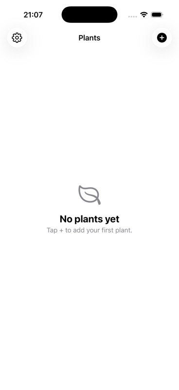
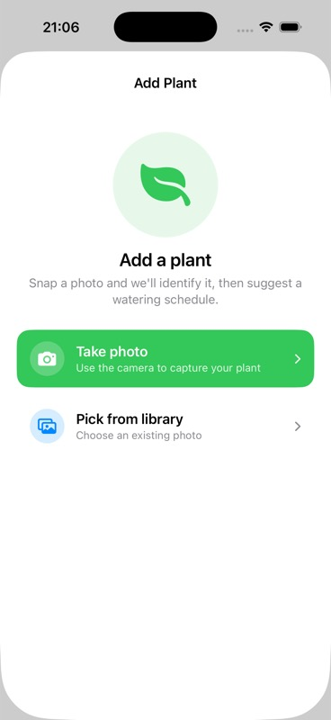
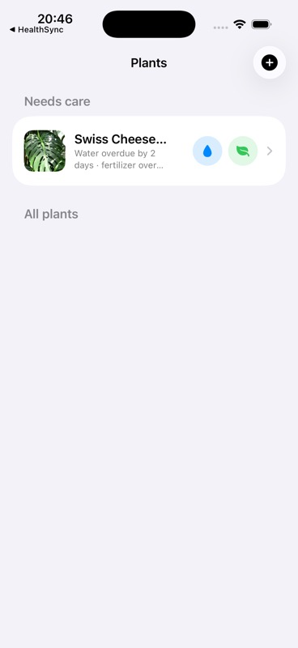
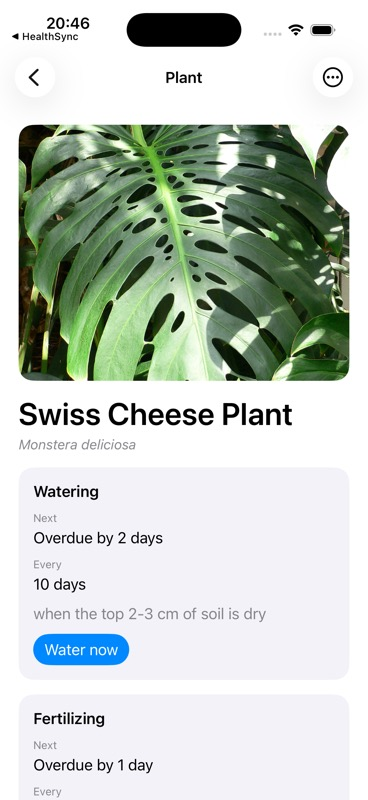
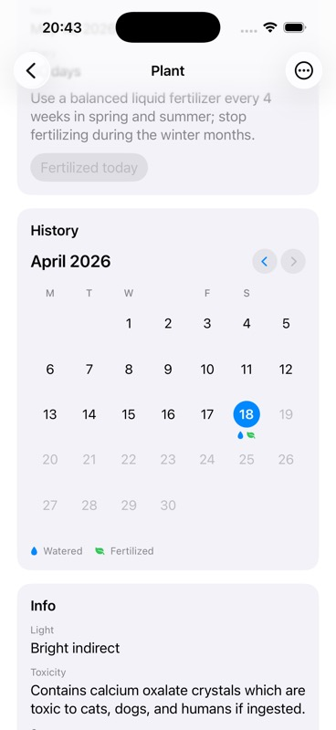
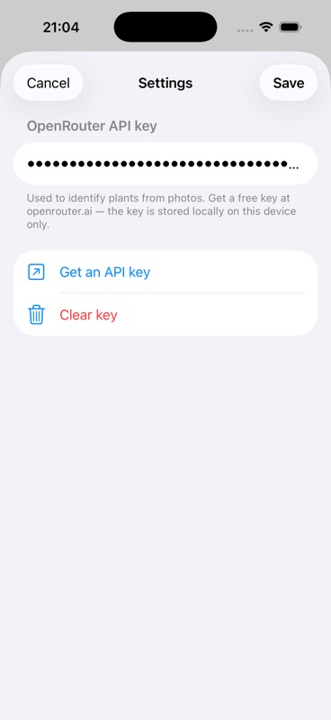

# Plants

A small iOS app for keeping houseplants alive. Snap a photo, let the model suggest care intervals, and get nudged when something needs water or fertilizer. Built with SwiftUI + SwiftData for iOS 26.

<p align="center">
  
  
  
</p>
<p align="center">
  
  
  
</p>

## Features

- **Photo-based identification.** Take or pick a photo of a plant; an LLM suggests a name, watering interval, light needs, fertilizer schedule, toxicity notes, and a care tip.
- **"Needs care" shortcut.** The main list pins plants that are due or overdue at the top with inline droplet / leaf buttons — tap to mark watered or fertilized without opening the plant.
- **Local notifications.** Reminders fire on the plant's schedule. The notification itself has a "Mark as watered" action so you can dismiss and record in one tap.
- **Care history calendar.** Each plant has a month-by-month calendar with a droplet on days it was watered and a leaf on days it was fertilized.
- **Same-day lockout.** Once you've watered a plant today, the button reads "Watered today" and is disabled — no accidental double-taps.
- **In-app API key setup.** OpenRouter key is configured in Settings on first launch — nothing is bundled with the app.

## Requirements

- Xcode 26+
- [XcodeGen](https://github.com/yonaskolb/XcodeGen) (`brew install xcodegen`)
- An **OpenRouter API key** for the plant identification step. Get one at [openrouter.ai/keys](https://openrouter.ai/keys) — the free tier is enough for casual use.

## Running it locally

1. Generate the Xcode project:
   ```
   xcodegen generate
   open Plants.xcodeproj
   ```
2. Build and run on an iOS 26 simulator (or your device).
3. On first launch, the app will open Settings automatically and ask for your OpenRouter key. Paste it in, tap **Save**, and you're done — the key is stored in `UserDefaults` locally on the device only.

### Debug shortcuts

- Set the env var `PLANTS_DEBUG_SAMPLE_IMAGE=/absolute/path/to/image.jpg` on the scheme's Run action. A debug-only "Use sample image" button appears on the Add Plant screen that uses that image instead of forcing you through the picker.
- On the plant detail view's ellipsis menu, `Simulate overdue (debug)` backdates `lastWatered` / `lastFertilized` so the plant immediately shows up in the "Needs care" section.

## Stack

- Swift 6 / SwiftUI / SwiftData
- `UserNotifications` for scheduled reminders with inline actions
- OpenRouter for plant identification (Gemini-class model)
- XcodeGen to generate `Plants.xcodeproj` from `project.yml`

## Project layout

```
Plants/
  Models/            # SwiftData @Model types: Plant, CareEvent
  Services/          # NotificationService, GeminiClient, PlantCareActions, Secrets
  Views/             # SwiftUI views (list, detail, add, history, settings)
    Components/      # Small reusable views (PlantPhotoView, PlantRowView, PlantCareRowView)
  Resources/         # Asset catalog + Info.plist
project.yml          # XcodeGen source of truth
```

## License

MIT. Do what you like.
