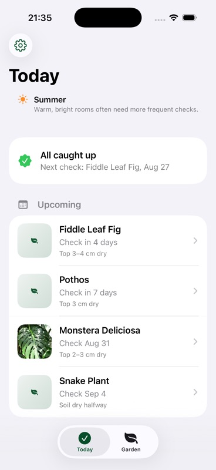
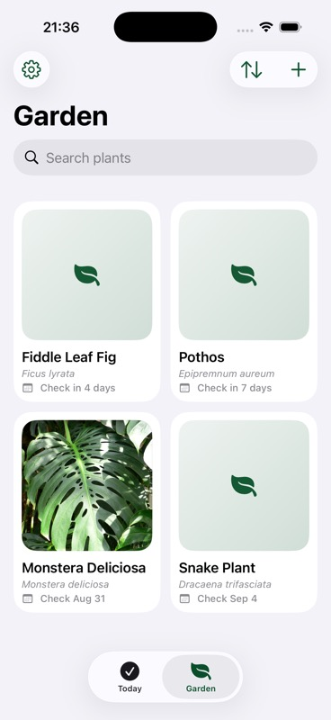
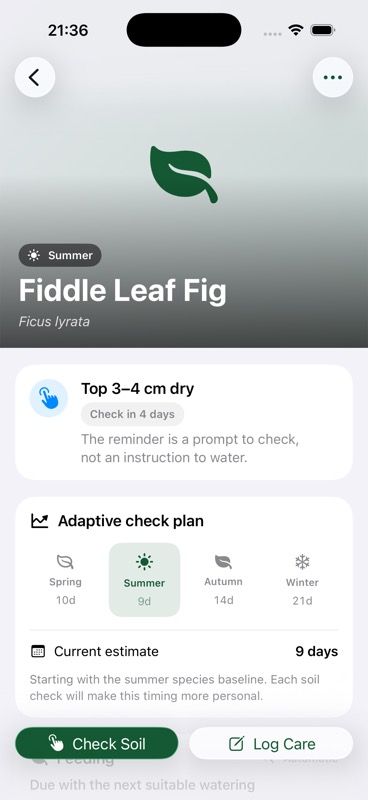
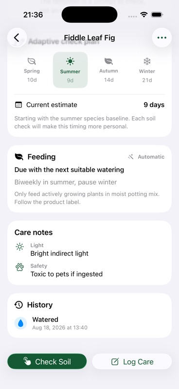
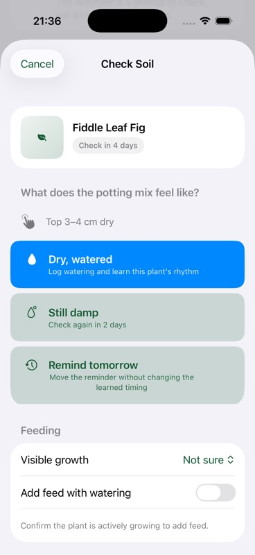
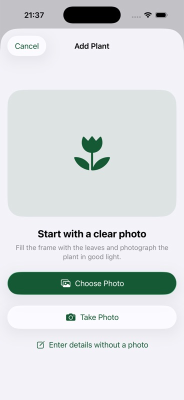
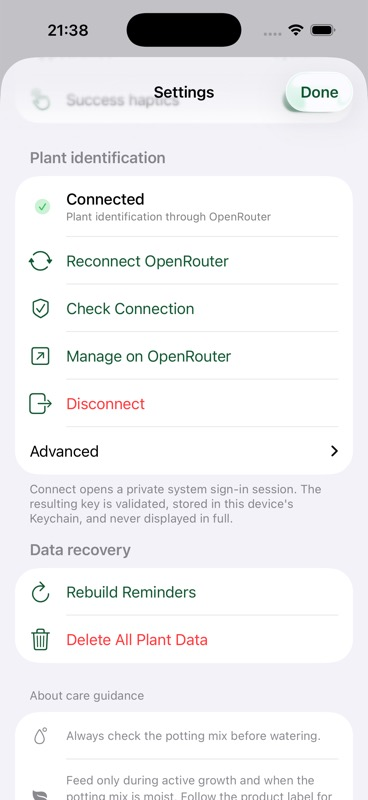

# Plants

Plants is a private, adaptive houseplant care companion for iOS 26. It replaces rigid “water now” schedules with soil-check reminders, then learns from each plant’s observed drying rhythm.

Built with SwiftUI, SwiftData, native Liquid Glass controls, and SF Symbols.

<p align="center">
  
  
  
</p>
<p align="center">
  
  
  
</p>
<p align="center">
  
</p>

## Features

- **Today and Garden.** Today prioritizes due and upcoming soil checks. Garden provides a searchable, sortable photo grid with native per-tab navigation.
- **Adaptive care timing.** Species-specific seasonal intervals provide the starting point. Logged watering cycles then teach the app how quickly each plant actually dries in its current pot, substrate, light, temperature, and humidity.
- **Check soil, then act.** Every reminder offers **Dry, watered**, **Still damp**, or **Remind tomorrow**. Damp observations schedule a short recheck; snoozes do not distort the learned interval.
- **Growth-aware feeding.** Fertilizer reminders respect active, resting, or automatic growth state. Feeding is offered with watering only after the user confirms the potting mix is ready.
- **Photo identification.** OpenRouter sends plant photos to `google/gemini-3.7-flash` with structured output for identity, seasonal check baselines, feeding, light, toxicity, and care notes. Uncertain or malformed results are never saved silently.
- **Private OpenRouter connection.** Connect through the native system authentication session with S256 PKCE. The returned key is validated and stored as device-only Keychain data. Manual key entry remains available under Advanced.
- **Actionable notifications.** One pending soil-check reminder is maintained per plant at the chosen local time. Notification actions mirror the in-app outcomes and normal taps deep-link to the plant.
- **Safe local history.** Photos, plants, and care events stay in SwiftData. Every care action provides Undo, and migration failures show recovery options instead of deleting the database.
- **Native accessibility.** Dynamic Type, VoiceOver summaries, dark mode, Reduce Motion, Reduce Transparency, semantic colors, and 44-point controls are built in.

## How recommendations work

1. Gemini supplies four species-specific seasonal soil-check baselines.
2. Hemisphere selects the relevant fallback season. It does not impose a universal winter multiplier.
3. After at least two valid cycles, the median of up to three recent watering cycles from the current season becomes authoritative.
4. A damp-soil result schedules a recheck after 20% of the predicted interval, clamped to 1–3 days.
5. Fertilizer reminders pause while a plant is resting and never recommend applying feed to dry potting mix.

These recommendations are prompts to observe the plant and potting mix, not instructions to water blindly.

## Requirements

- Xcode 26+
- iOS 26+ simulator or device
- [XcodeGen](https://github.com/yonaskolb/XcodeGen)
- An OpenRouter account for photo identification

OpenRouter is optional if plants are entered manually. The app has no backend and does not require location or weather access.

## Run locally

```bash
brew install xcodegen
xcodegen generate
open Plants.xcodeproj
```

Select the `Plants` scheme and run it on an iOS 26 simulator or device. Add Plant supports both photo identification and manual entry.

To connect identification without copying a key, open **Settings → Plant identification → Connect OpenRouter**. Advanced manual entry is available as a recovery path.

## Test

Run the `Plants` scheme’s test action in Xcode, or use:

```bash
xcodebuild \
  -project Plants.xcodeproj \
  -scheme Plants \
  -destination 'platform=iOS Simulator,name=iPhone 17 Pro' \
  test
```

The test target covers adaptive intervals, season and hemisphere mapping, fertilizer growth states, undo, DST-safe reminder dates, notification replacement, Gemini response validation, PKCE, Keychain migration, and SwiftData migration.

## Privacy

- Plant data, photos, settings, and care history are stored locally.
- A photo is sent to OpenRouter only when the user requests identification.
- The OpenRouter key is stored with `kSecAttrAccessibleWhenUnlockedThisDeviceOnly` and is never displayed in full.
- There is no Plants account, analytics backend, location access, or weather integration.

## Stack

- Swift 6, SwiftUI, and SwiftData
- UserNotifications
- AuthenticationServices, CryptoKit, and Keychain Services
- OpenRouter with Gemini 3.7 Flash
- XcodeGen

## Project layout

```text
Plants/
  Models/            SwiftData models, migration schemas, seasons, care recommendations
  Services/          Adaptive care, notifications, Gemini, OAuth, Keychain, and settings
  Views/             Today, Garden, detail, Add Plant, Settings, and care flows
    Components/      Reusable plant photos and care rows
  Resources/         Asset catalog
PlantsTests/         Domain, persistence, notification, OAuth, and networking tests
project.yml          XcodeGen source of truth
```

## License

MIT.
